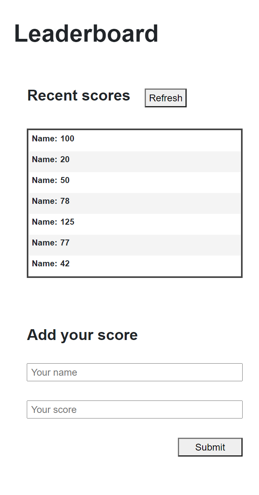
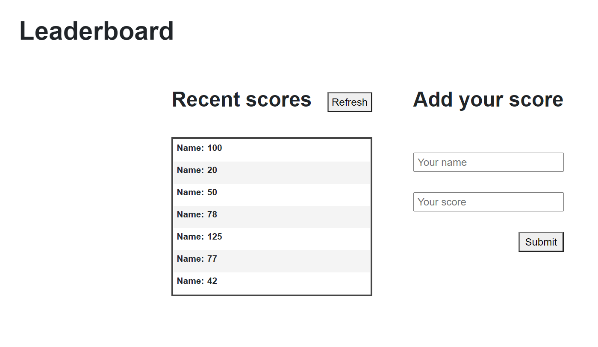

# Leaderboard App

This a Simple game which displays the scores gotten from playing the leaderboard game. 

Below you can see how this website look on mobile and desktop respectively:





## Setup

### Clone this repository

```bash
$ git clone git@github.com:julie-ify/Leaderboard.git
$ cd Leaderboard
```

### Run project

```bash
$ npm install
$ npm run start # this will make webpack watching for your changes in code
```

### Open page in browser
```bash
$ open dist/index.html
```


## Built With

- HTML
- JavaScript


## Author

👤 **Ifionu Juliana**

- GitHub: [@githubhandle](https://github.com/julie-ify)
- LinkedIn: [LinkedIn](https://www.linkedin.com/in/e-ifionu/)

## 🤝 Contributing

Contributions, issues, and feature requests are welcome!

Feel free to check the [issues page](https://github.com/julie-ify/Leaderboard/issues).

## Show your support

Give a ⭐️ if you like this project!

## 📝 License

This project is [MIT](./MIT.md) licensed.